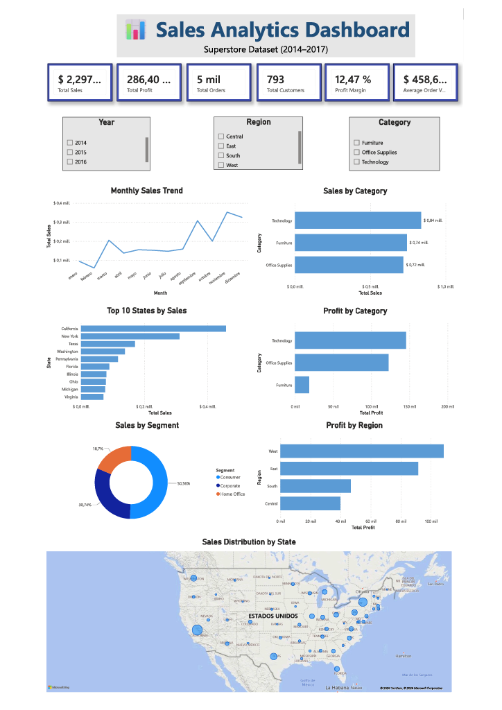

# Sales Analytics Dashboard

Interactive Sales Analytics Dashboard built with **Python, Pandas, and Power BI** to analyze sales performance, customer behavior, profitability, and regional trends using the Superstore dataset.

This project demonstrates the complete analytics workflow, including data cleaning, exploratory data analysis (EDA), KPI calculation, and interactive dashboard development for business decision-making.

---

## Dashboard Preview



---

# Project Overview

Businesses generate large amounts of sales data every day, but transforming raw data into actionable insights requires an effective analytics process.

This project analyzes historical sales transactions from the Superstore dataset to identify business performance, customer trends, profitable categories, and geographic distribution through an interactive Power BI dashboard.

---

# Dataset

**Dataset:** Superstore Sales Dataset

The dataset contains information about:

- Orders
- Customers
- Products
- Categories
- Sales
- Profit
- Discount
- Quantity
- Shipping
- Geographic information

---

# 🛠️ Technologies Used

| Technology | Purpose |
|------------|---------|
| Python | Data Cleaning |
| Pandas | Data Processing |
| NumPy | Data Manipulation |
| Matplotlib | Exploratory Analysis |
| Jupyter Notebook | Data Analysis |
| Power BI | Dashboard Development |
| Git | Version Control |
| GitHub | Project Portfolio |

---

# 🔄 ETL Process

## 📥 Extract

- Imported Superstore CSV dataset.
- Loaded data into Pandas DataFrame.

## 🔄 Transform

- Removed duplicate records.
- Checked missing values.
- Converted date columns to datetime format.
- Created Month, Month Number, Year and Quarter columns.
- Calculated business KPIs.
- Prepared dataset for visualization.

## 📤 Load

- Exported cleaned dataset.
- Imported processed dataset into Power BI.

---

# 📈 Key Performance Indicators (KPIs)

The dashboard includes the following KPIs:

- 💰 Total Sales
- 📈 Total Profit
- 🛒 Total Orders
- 👥 Total Customers
- 📦 Average Order Value
- 📊 Profit Margin

---

# Dashboard Features

The interactive dashboard contains:

### 📈 Monthly Sales Trend
Visualizes monthly sales performance throughout the year.

### 🏷️ Sales by Category
Compares total sales across product categories.

### 🏆 Top 10 States by Sales
Highlights the highest-performing states.

### 💵 Profit by Category
Displays profit generated by each product category.

### 👥 Sales by Segment
Shows sales distribution among customer segments.

### 🌎 Profit by Region
Compares profitability across business regions.

### 🗺️ Sales by State
Interactive geographic map displaying sales distribution.

### 🎛️ Interactive Filters

- Year
- Region
- Category

---

# Business Insights

Some important findings from the dashboard include:

- Technology is the highest-performing product category.
- Consumer represents the largest customer segment.
- Sales increase significantly during the last quarter of the year.
- Sales performance varies considerably across states.
- A small number of states generate a significant percentage of total revenue.

---

# 📁 Repository Structure

```text
sales-analytics-dashboard/
│
├── dashboards/
│   └── sales_analytics_dashboard.pbix
│
├── data/
│   ├── raw/
│   │   └── Superstore.csv
│   │
│   └── processed/
│       └── superstore_clean.csv
│
├── images/
│   └── dashboard-preview.png
│
├── notebooks/
│   └── sales_analytics.ipynb
│
├── README.md
│
├── requirements.txt
│
└── .gitignore
```

---

# ▶️ How to Run

## Clone the repository

```bash
git clone https://github.com/LsofiaAmado/sales-analytics-dashboard.git
```

## Install dependencies

```bash
pip install -r requirements.txt
```

## Run the notebook

Open:

```text
notebooks/sales_analytics.ipynb
```

Execute all cells.

## Open the Dashboard

Open:

```text
dashboards/sales_analytics_dashboard.pbix
```

using Microsoft Power BI Desktop.

---

# Skills Demonstrated

- Python Programming
- Data Cleaning with Pandas
- Exploratory Data Analysis (EDA)
- KPI Design
- Business Intelligence
- Interactive Dashboard Development
- Data Visualization with Power BI
- Data Storytelling
- Git & GitHub

---

# Author

**Laura Sofía Amado González**

Systems Engineer

Data Analytics

🤖 Machine Learning

GitHub: **https://github.com/LsofiaAmado**

